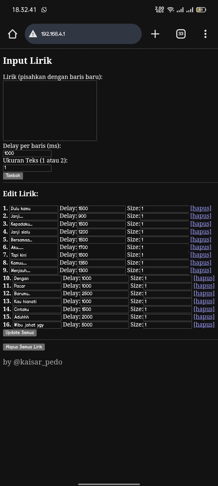
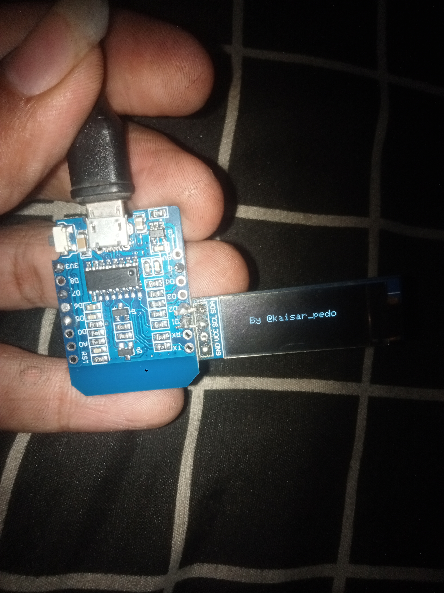
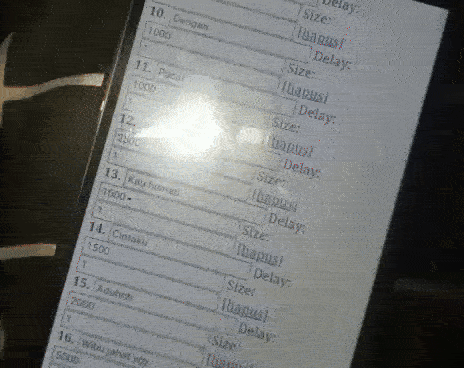

# Esp8266-lirik

* Nampilin lirik di oled pakai esp8266
* edit lirik di web, sambung wifinya dan buka 198.168.4.1
* nama wifi "lirik"
* password "12345678"

# picture

*  
*  

# WIRING 

* gnd to gnd
* vcc to 3.3  
* sda to d2
* scl to d1

# video

* 
* 
